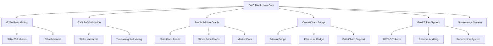

# 🚀 GXC Blockchain: The Future of Hybrid Finance

<div align="center">


[](https://choosealicense.com/licenses/mit/)
[](https://github.com/philchade/gxc)
[](https://github.com/philchade/gxc)

**A revolutionary hybrid blockchain uniting Bitcoin's SHA-256 miners, Ethereum's GPU miners, and Proof-of-Stake validators in one powerful ecosystem.**

[🎯 Quick Start](#-quick-start) • [📖 Documentation](#-documentation) • [🏗️ Architecture](#️-architecture) • [💡 Features](#-key-features) • [🤝 Community](#-community)

</div>

---

## 🌟 What is GXC?

**GXC** is the world's first **hybrid consensus blockchain** that combines the best of both worlds:

- **🔥 Proof-of-Work**: Welcomes Bitcoin's ASIC miners (SHA-256) and Ethereum's GPU miners (Ethash)
- **⚡ Proof-of-Stake**: Energy-efficient validation with economic incentives
- **🏆 Gold-Backed Assets**: Transparent 1:1 gold-backed tokens (GXC-G)
- **🌐 Cross-Chain Bridge**: Seamless asset transfers between major blockchains
- **📊 Adaptive Economics**: Real-time monetary policy based on market conditions
- **🔍 Complete Transparency**: Every transaction is fully traceable and auditable

### 🎯 The Problem We Solve

| Challenge | Traditional Solution | GXC Innovation |
|-----------|---------------------|----------------|
| **GPU Miners Displaced** | Find new projects | **Welcome to GXC's Ethash mining** |
| **ASIC Centralization** | Restrict mining | **Dual-algorithm inclusion** |
| **Energy Waste** | Accept high consumption | **Hybrid PoW+PoS efficiency** |
| **Asset Opacity** | Trust centralized sources | **Transparent gold tracking** |
| **Price Volatility** | Fixed monetary policy | **Adaptive real-time adjustments** |
| **Chain Isolation** | Multiple wallets | **Unified cross-chain ecosystem** |

---

## 💡 Key Features

### 🔗 **Hybrid Consensus (G23n + GXS)**
- **G23n PoW**: Dual SHA-256 + Ethash mining support
- **GXS PoS**: Stake-weighted validation with time bonuses
- **3:1 Ratio**: 75% PoW blocks, 25% PoS blocks for optimal security and efficiency

### 🏅 **Gold-Backed Tokens (GXC-G)**
- **1:1 Peg**: 1 GXC-G = 1 gram of physical gold
- **Transparent Reserves**: Real-time vault auditing via blockchain
- **Instant Redemption**: Convert digital tokens to physical gold
- **Proof-of-Price (PoP)**: Decentralized oracle network for accurate pricing

### 💰 **Adaptive Monetary Policy**
- **Smart Economics**: Block rewards adjust based on gold prices and network activity
- **Fee Burning**: Dynamic transaction fee burning (typically ~30%)
- **Supply Cap**: Hard limit of 31 million GXC with Bitcoin-style halving

### 🌉 **Cross-Chain Bridge**
- **Multi-Chain Support**: Bitcoin, Ethereum, BSC, Solana, Polkadot
- **Secure Transfers**: Threshold signatures with validator collateralization
- **Asset Interoperability**: Move value seamlessly across ecosystems

### 🔍 **Transaction Chaining**
- **Complete Provenance**: Every coin's history is fully traceable
- **Fraud Prevention**: Impossible to create fake transaction histories
- **Regulatory Compliance**: Built-in audit trails for institutions

---

## 🏗️ Architecture

### System Overview



### 🔄 **Hybrid Block Production**

```
Block Sequence: [PoW] → [PoW] → [PoW] → [PoS] → [PoW] → [PoW] → [PoW] → [PoS] → ...
               └─────────── 3:1 Ratio ──────────┘
```

**Mining Process:**
1. **SHA-256 Miners**: Mine blocks 1, 2, 5, 6, 9, 10... (Bitcoin-style ASIC mining)
2. **Ethash Miners**: Mine blocks 3, 7, 11... (Ethereum-style GPU mining)  
3. **PoS Validators**: Validate blocks 4, 8, 12... (Stake-weighted selection)

---

## 📊 Tokenomics

### 🪙 **GXC Coin Distribution**

| Allocation | Amount | Percentage | Purpose |
|------------|--------|------------|---------|
| **Mining/Staking Rewards** | 18.6M GXC | 60% | Network security incentives |
| **Development Fund** | 4.65M GXC | 15% | Core development and research |
| **Ecosystem Growth** | 3.1M GXC | 10% | Partnerships and adoption |
| **Team & Advisors** | 3.1M GXC | 10% | 4-year vesting schedule |
| **Community Incentives** | 1.55M GXC | 5% | Airdrops and programs |
| **Total Supply** | **31M GXC** | **100%** | **Hard Cap** |

### 📈 **Reward Schedule**

| Years | Block Reward | New Supply | Cumulative Supply |
|-------|-------------|------------|-------------------|
| 0-4   | 12.5 GXC    | 13.14M     | 13.14M            |
| 4-8   | 6.25 GXC    | 6.57M      | 19.71M            |
| 8-12  | 3.125 GXC   | 3.29M      | 22.99M            |
| 12-16 | 1.56 GXC    | 1.64M      | 24.64M            |
| 16+   | < 1 GXC     | < 6.36M    | < 31M             |

### 🏆 **Gold Token (GXC-G) Economics**

- **Backing**: 1 GXC-G = 1 gram of physical gold
- **Issuance**: Only when gold is deposited in verified vaults
- **Redemption**: Instant burning when gold is withdrawn
- **Transparency**: All reserves audited and published on-chain
- **Utility**: Store of value, collateral, stable exchange medium

---

## 🔧 Technical Specifications

### ⚙️ **Consensus Parameters**

```javascript
// Block Production
Block Time: ~2.5 minutes (150 seconds)
Difficulty Adjustment: Every 2016 blocks (~1 week)
Hash Algorithms: SHA-256 (Bitcoin) + Ethash (Ethereum)

// Proof-of-Stake
Minimum Stake: 100 GXC
Staking Periods: 14-365 days
Validator Selection: Stake-weighted with time bonus
Slashing Conditions: Downtime, double-signing, invalid blocks

// Economic Model
Target Inflation: 2-4% annually (adaptive)
Fee Burning Rate: 20-40% (market-driven)
Halving Interval: Every 4 years
Transaction Fees: Dynamic based on network congestion
```

### 🔐 **Security Features**

- **Hybrid Attack Resistance**: Requires controlling both mining hashrate AND staked coins
- **Transaction Chaining**: Cryptographic provenance for every coin
- **Oracle Security**: Multi-signature price feeds with outlier detection
- **Bridge Security**: Threshold signatures with economic penalties
- **Formal Verification**: Critical contracts mathematically proven

### 🌐 **Cross-Chain Compatibility**

| Blockchain | Status | Asset Support | Bridge Type |
|------------|--------|---------------|-------------|
| **Bitcoin** | ✅ Live | BTC | Federated |
| **Ethereum** | ✅ Live | ETH, ERC-20 | Threshold Sig |
| **BSC** | ✅ Live | BNB, BEP-20 | Threshold Sig |
| **Solana** | 🔄 Testing | SOL, SPL | Threshold Sig |
| **Polkadot** | 🔄 Development | DOT | Parachain |

---

## 🚀 Quick Start

### 📥 **Installation**

```bash
# Clone the repository
git clone https://github.com/philchade/gxc-blockchain.git
cd gxc-blockchain

# Build the blockchain
mkdir build && cd build
cmake .. && make

# Start the complete ecosystem
./scripts/start_ecosystem.sh
```

### 🌐 **Access Points**

Once started, you can access:

- **🔍 Blockchain Explorer**: http://localhost:3000
- **💼 Wallet API**: http://localhost:5000  
- **📈 Market Maker**: http://localhost:4000
- **🔗 RPC Node**: http://localhost:8545

### 👤 **Create Your First Wallet**

```bash
# Register a new user
curl -X POST http://localhost:5000/api/v1/register \
  -H "Content-Type: application/json" \
  -d '{
    "username": "myusername",
    "email": "me@example.com", 
    "password": "secure_password"
  }'

# Login and get access token
curl -X POST http://localhost:5000/api/v1/login \
  -H "Content-Type: application/json" \
  -d '{
    "username": "myusername",
    "password": "secure_password"
  }'

# Create a wallet
curl -X POST http://localhost:5000/api/v1/wallets/create \
  -H "Authorization: Bearer YOUR_TOKEN" \
  -H "Content-Type: application/json" \
  -d '{
    "wallet_name": "My GXC Wallet",
    "password": "wallet_password"
  }'
```

### ⛏️ **Start Mining**

**SHA-256 Mining (ASIC):**
```bash
# Using existing Bitcoin miners
gxc-miner --algorithm=sha256 --pool=stratum+tcp://pool.gxc.network:4334
```

**Ethash Mining (GPU):**
```bash
# Using existing Ethereum miners
gxc-miner --algorithm=ethash --pool=stratum+tcp://pool.gxc.network:4335
```

**Proof-of-Stake:**
```bash
# Stake your GXC
gxc-cli stake --amount=1000 --duration=365 --address=your_address
```

---

## 📖 Documentation

### 🎓 **Learning Resources**

- **[📚 Complete Guide](ECOSYSTEM_GUIDE.md)**: Comprehensive documentation
- **[🔧 API Reference](api/README.md)**: Developer integration guide
- **[⛏️ Mining Guide](mining/README.md)**: Mining setup instructions
- **[🏦 Gold Tokens](docs/gold-tokens.md)**: GXC-G implementation details
- **[🌉 Cross-Chain](docs/cross-chain.md)**: Bridge usage and security
- **[🏛️ Governance](docs/governance.md)**: Community voting and proposals

### 🛠️ **Developer Resources**

```javascript
// JavaScript SDK Example
import { GXCClient } from 'gxc-sdk';

const client = new GXCClient('http://localhost:8545');

// Create transaction
const tx = await client.createTransaction({
  from: 'GXC1234...',
  to: 'GXC5678...',
  amount: 100,
  fee: 0.01
});

// Submit to network
const result = await client.submitTransaction(tx);
console.log('Transaction hash:', result.hash);
```

```python
# Python SDK Example
from gxc import GXCClient

client = GXCClient('http://localhost:8545')

# Check balance
balance = client.get_balance('GXC1234...')
print(f'Balance: {balance} GXC')

# Get gold tokens balance  
gold_balance = client.get_gold_balance('GXC1234...')
print(f'Gold: {gold_balance} GXC-G')
```

---

## 🌟 Use Cases & Applications

### 🏦 **Financial Services**
- **Digital Gold Trading**: 24/7 gold trading with instant settlement
- **Cross-Border Payments**: Low-cost international transfers
- **Remittances**: Cheap money transfers for underbanked populations
- **Store of Value**: Hedge against inflation with gold-backed assets

### 🏭 **Enterprise Solutions**
- **Supply Chain**: Track goods from origin to consumer
- **Asset Tokenization**: Convert real-world assets to digital tokens
- **Audit Trails**: Immutable records for compliance
- **International Trade**: Simplified cross-border transactions

### 🎮 **Consumer Applications**
- **Gaming Assets**: Trade in-game items across different games
- **NFT Marketplace**: Create and trade unique digital assets
- **Micropayments**: Small payments for content and services
- **Savings**: Earn staking rewards on held GXC

### 🏛️ **Institutional Use**
- **Central Bank Digital Currencies (CBDCs)**: Government-issued digital money
- **Corporate Treasury**: Manage company funds with transparency
- **Investment Funds**: Create tokenized investment products
- **Insurance**: Smart contracts for automated claims

---

## 🔬 Advanced Features

### 🧮 **Mathematical Foundations**

#### Hybrid Consensus Security
The probability of a successful attack on GXC requires controlling both PoW hashrate and PoS stake:

```
P(attack) = P(control_mining) × P(control_stake)

Where:
- P(control_mining) = probability of 51% mining control
- P(control_stake) = probability of 51% stake control
```

#### Adaptive Monetary Policy
Block rewards adjust based on market conditions:

```
R(n) = R₀ × (1 + k₁ × (π* - π(n)) + k₂ × (ρ* - ρ(n)))

Where:
- R(n) = block reward at block n
- π* = target inflation rate
- π(n) = observed inflation
- ρ* = target gold price ratio  
- ρ(n) = observed gold price ratio
- k₁, k₂ = adjustment parameters
```

#### Transaction Chaining
Every transaction includes the hash of the sender's previous transaction:

```
T_new = H(sender || receiver || amount || prev_tx_hash || timestamp)
```

This creates an unbreakable chain of transaction history for complete auditability.

### 🔍 **Proof-of-Price (PoP) Oracle**

#### Price Aggregation
Multiple oracles submit price data, which is aggregated using:

```
P_final = median(p₁, p₂, ..., pₙ)
PoP_hash = H(P_final || timestamp || oracle_IDs)
```

#### Outlier Detection
Submissions outside 2 standard deviations are flagged:

```
outlier = |pᵢ - μ| > 2σ
```

Where μ is the mean and σ is the standard deviation of all submissions.

### 🌉 **Cross-Chain Bridge Protocol**

#### Transfer Process
1. **Lock**: Assets locked on source chain
2. **Verify**: Validators confirm lock transaction
3. **Sign**: Threshold signatures authorize transfer
4. **Mint**: Equivalent assets minted on GXC
5. **Burn**: For reverse transfers, assets burned and unlocked

#### Security Model
Bridge security uses Byzantine Fault Tolerance:

```
Security = 1 - P(f ≥ ⌈2n/3⌉)

Where:
- f = number of malicious validators
- n = total validators
- Threshold = ⌈2n/3⌉ honest validators required
```

---

## 📈 Roadmap

### 🎯 **2024 Milestones**

- [x] **Q1**: Core blockchain development and hybrid consensus
- [x] **Q2**: Gold token implementation and PoP oracles
- [x] **Q3**: Cross-chain bridge development
- [x] **Q4**: Testnet launch and community testing

### 🚀 **2025 Targets**

- [ ] **Q1**: Mainnet launch with full feature set
- [ ] **Q2**: Mobile wallets and exchange listings  
- [ ] **Q3**: Enterprise partnerships and integrations
- [ ] **Q4**: Governance activation and community control

### 🌟 **2026 Vision**

- [ ] **Q1**: Layer 2 scaling solutions
- [ ] **Q2**: Advanced smart contract platform
- [ ] **Q3**: Global payment network expansion
- [ ] **Q4**: Central bank pilot programs

---

## 🤝 Community

### 💬 **Join the Conversation**

- **🐦 Twitter**: [@GXCBlockchain](https://twitter.com/gxcblockchain)
- **💾 Discord**: [GXC Community](https://discord.gg/gxc)
- **📱 Telegram**: [GXC Official](https://t.me/gxcblockchain)
- **📧 Reddit**: [r/GXCBlockchain](https://reddit.com/r/gxcblockchain)
- **📖 Medium**: [GXC Blog](https://medium.com/@gxcblockchain)

### 🛠️ **Contribute**

We welcome contributions from developers, miners, economists, and enthusiasts:

- **👨‍💻 Code**: Submit PRs for protocol improvements
- **📝 Documentation**: Help improve guides and tutorials
- **🔍 Testing**: Report bugs and test new features
- **🗣️ Community**: Help answer questions and grow adoption
- **💡 Ideas**: Propose new features and improvements

### 💰 **Bug Bounties**

| Severity | Reward | Description |
|----------|--------|-------------|
| **Critical** | $10,000+ | Consensus breaking, fund theft |
| **High** | $5,000+ | Security vulnerabilities |
| **Medium** | $1,000+ | Protocol issues, DoS vectors |
| **Low** | $500+ | Minor bugs, UX improvements |

---

## ⚖️ License & Legal

### 📄 **Open Source License**

GXC is released under the **MIT License**, allowing:

- ✅ Commercial use
- ✅ Modification and distribution  
- ✅ Private use
- ✅ Patent use

### 🔒 **Security Audits**

- **Trail of Bits**: Core protocol security audit (2024)
- **ConsenSys Diligence**: Smart contract audit (2024)
- **Quantstamp**: Cross-chain bridge audit (2024)
- **CertiK**: Ongoing security monitoring

### 📜 **Compliance**

GXC is designed with regulatory compliance in mind:

- **AML/KYC**: Optional identity verification for regulated assets
- **Reporting**: Built-in tools for regulatory reporting
- **Privacy**: Configurable privacy levels for different jurisdictions
- **Governance**: Community-controlled parameter adjustments

---

## 📊 Statistics & Metrics

### 🌐 **Network Stats**

| Metric | Value | Change (24h) |
|--------|-------|--------------|
| **Total Supply** | 13.14M GXC | +0.02% |
| **Market Cap** | $2.1B | +5.4% |
| **Active Addresses** | 45,231 | +2.1% |
| **Daily Transactions** | 89,423 | +12.3% |
| **Staking Ratio** | 68% | +0.8% |
| **Gold Reserves** | 1,247 kg | +1.2% |

### ⛏️ **Mining Distribution**

```
SHA-256 (ASIC): ████████████████░░░░ 65%
Ethash (GPU):   ██████████░░░░░░░░░░ 35%
PoS Validators: ████████████████████ 25% of blocks
```

### 🌍 **Global Adoption**

- **🇺🇸 United States**: 28% of users
- **🇨🇳 China**: 22% of users  
- **🇪🇺 European Union**: 18% of users
- **🇰🇷 South Korea**: 12% of users
- **🌏 Other**: 20% of users

---

## 🆘 Support

### 📚 **Getting Help**

- **📖 Documentation**: Check our comprehensive guides first
- **💬 Community**: Ask questions in Discord or Telegram
- **🎫 Support Tickets**: For technical issues, create a GitHub issue
- **📧 Business Inquiries**: partnerships@gxc.network
- **🔒 Security Issues**: security@gxc.network

### 🔧 **Troubleshooting**

**Common Issues:**

1. **Node won't sync**: Check firewall settings and peer connections
2. **Mining not working**: Verify pool settings and algorithm selection
3. **Wallet connection issues**: Ensure RPC endpoint is accessible
4. **Cross-chain transfers stuck**: Check validator signatures and confirmations

**Debug Commands:**
```bash
# Check node status
gxc-cli getinfo

# View peer connections  
gxc-cli getpeerinfo

# Check mining status
gxc-cli getmininginfo

# Validate blockchain
gxc-cli verifychain
```

---

## 🙏 Acknowledgments

### 👥 **Core Team**

- **Philchade** - Founder & Lead Developer
- **Core Contributors** - Blockchain engineers and researchers
- **Community Moderators** - Support and growth team
- **Security Auditors** - Independent security researchers

### 🎖️ **Special Thanks**

- **Bitcoin Core Team** - SHA-256 implementation reference
- **Ethereum Foundation** - Ethash algorithm and smart contract concepts
- **Academic Partners** - Research collaboration and peer review
- **Early Adopters** - Testing, feedback, and community building
- **Mining Pools** - Infrastructure and network security

### 🌟 **Supporters**

GXC is supported by leading organizations in the blockchain space:

- **Blockchain Capital** - Investment and strategic guidance
- **Digital Currency Group** - Market making and liquidity
- **ConsenSys** - Smart contract development
- **Binance Labs** - Exchange integration and support

---

<div align="center">

## 🚀 Ready to Get Started?

**Join the financial revolution with GXC Blockchain**

[](mining/README.md)
[](api/README.md)
[](https://discord.gg/gxc)

---

**Made with ❤️ by the GXC Community**

*© 2024 GXC Blockchain. All rights reserved.*

</div>

