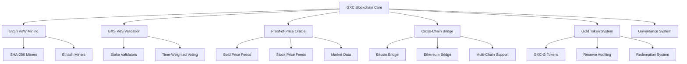

# 🚀 GXC Blockchain: The Future of Hybrid Finance

<div align="center">


[](https://choosealicense.com/licenses/mit/)
[](https://github.com/philchade/gxc)
[](https://github.com/philchade/gxc)

**A revolutionary hybrid blockchain uniting Bitcoin's SHA-256 miners, Ethereum's GPU miners, and Proof-of-Stake validators in one powerful ecosystem.**

[🎯 Quick Start](#-quick-start) • [📖 Documentation](#-documentation) • [🏗️ Architecture](#️-architecture) • [💡 Features](#-key-features) • [🤝 Community](#-community)

</div>

---

## 🌟 What is GXC?

**GXC** is the world's first **hybrid consensus blockchain** that combines the best of both worlds:

- **🔥 Proof-of-Work**: Welcomes Bitcoin's ASIC miners (SHA-256) and Ethereum's GPU miners (Ethash)
- **⚡ Proof-of-Stake**: Energy-efficient validation with economic incentives
- **🏆 Gold-Backed Assets**: Transparent 1:1 gold-backed tokens (GXC-G)
- **🌐 Cross-Chain Bridge**: Seamless asset transfers between major blockchains
- **📊 Adaptive Economics**: Real-time monetary policy based on market conditions
- **🔍 Complete Transparency**: Every transaction is fully traceable and auditable

## 🎯 Why GXC Was Designed

### **The Vision: Uniting Divided Communities**

GXC was born from a critical observation: the blockchain ecosystem is becoming increasingly fragmented. When Ethereum transitioned to Proof-of-Stake, millions of GPU miners were displaced. Meanwhile, Bitcoin's SHA-256 mining remains dominated by large ASIC farms, excluding smaller participants. Traditional asset classes like gold lack transparent, tamper-proof digital representations.

**Our mission is simple but profound**: Create a blockchain that unites rather than divides, bridges rather than isolates, and includes rather than excludes.

### **Core Design Principles**

1. **🌐 Inclusivity Over Exclusivity**
   - Welcome ALL miners: ASIC (SHA-256), GPU (Ethash), and PoS validators
   - Lower barriers to participation through hybrid consensus
   - Provide multiple ways to contribute and earn rewards

2. **🔗 Bridging Over Isolation**
   - Connect traditional assets (gold) with digital innovation
   - Enable cross-chain asset movement between major blockchains
   - Unite different consensus mechanisms in one secure ecosystem

3. **📊 Adaptability Over Rigidity**
   - Dynamic monetary policy that responds to real market conditions
   - Oracle-driven price feeds for accurate asset tracking
   - Community governance for continuous improvement

4. **🔍 Transparency Over Opacity**
   - Every transaction fully traceable and auditable
   - Open-source development and public governance
   - Real-time verification of gold reserves and asset backing

5. **🚀 Innovation Over Imitation**
   - Novel hybrid consensus mechanism (G23n + GXS)
   - Revolutionary Proof-of-Price (PoP) oracle system
   - Advanced transaction chaining for complete provenance

### 🎯 The Problem We Solve

| Challenge | Traditional Solution | GXC Innovation |
|-----------|---------------------|----------------|
| **GPU Miners Displaced** | Find new projects | **Welcome to GXC's Ethash mining** |
| **ASIC Centralization** | Restrict mining | **Dual-algorithm inclusion** |
| **Energy Waste** | Accept high consumption | **Hybrid PoW+PoS efficiency** |
| **Asset Opacity** | Trust centralized sources | **Transparent gold tracking** |
| **Price Volatility** | Fixed monetary policy | **Adaptive real-time adjustments** |
| **Chain Isolation** | Multiple wallets | **Unified cross-chain ecosystem** |

---

## 💡 Key Features

### 🔗 **Hybrid Consensus (G23n + GXS)**
- **G23n PoW**: Dual SHA-256 + Ethash mining support
- **GXS PoS**: Stake-weighted validation with time bonuses
- **3:1 Ratio**: 75% PoW blocks, 25% PoS blocks for optimal security and efficiency

### 🏅 **Gold-Backed Tokens (GXC-G)**
- **1:1 Peg**: 1 GXC-G = 1 gram of physical gold
- **Transparent Reserves**: Real-time vault auditing via blockchain
- **Instant Redemption**: Convert digital tokens to physical gold
- **Proof-of-Price (PoP)**: Decentralized oracle network for accurate pricing

### 💰 **Adaptive Monetary Policy**
- **Smart Economics**: Block rewards adjust based on gold prices and network activity
- **Fee Burning**: Dynamic transaction fee burning (typically ~30%)
- **Supply Cap**: Hard limit of 31 million GXC with Bitcoin-style halving

### 🌉 **Cross-Chain Bridge**
- **Multi-Chain Support**: Bitcoin, Ethereum, BSC, Solana, Polkadot
- **Secure Transfers**: Threshold signatures with validator collateralization
- **Asset Interoperability**: Move value seamlessly across ecosystems

### 🔍 **Transaction Chaining**
- **Complete Provenance**: Every coin's history is fully traceable
- **Fraud Prevention**: Impossible to create fake transaction histories
- **Regulatory Compliance**: Built-in audit trails for institutions

---

## 🏗️ Architecture

### System Overview



### 🔄 **Hybrid Block Production**

```
Block Sequence: [PoW] → [PoW] → [PoW] → [PoS] → [PoW] → [PoW] → [PoW] → [PoS] → ...
               └─────────── 3:1 Ratio ──────────┘
```

**Mining Process:**
1. **SHA-256 Miners**: Mine blocks 1, 2, 5, 6, 9, 10... (Bitcoin-style ASIC mining)
2. **Ethash Miners**: Mine blocks 3, 7, 11... (Ethereum-style GPU mining)  
3. **PoS Validators**: Validate blocks 4, 8, 12... (Stake-weighted selection)

---

## 📊 Tokenomics

### 🪙 **GXC Coin Distribution**

| Allocation | Amount | Percentage | Purpose |
|------------|--------|------------|---------|
| **Mining/Staking Rewards** | 18.6M GXC | 60% | Network security incentives |
| **Development Fund** | 4.65M GXC | 15% | Core development and research |
| **Ecosystem Growth** | 3.1M GXC | 10% | Partnerships and adoption |
| **Team & Advisors** | 3.1M GXC | 10% | 4-year vesting schedule |
| **Community Incentives** | 1.55M GXC | 5% | Airdrops and programs |
| **Total Supply** | **31M GXC** | **100%** | **Hard Cap** |

### 📈 **Reward Schedule**

| Years | Block Reward | New Supply | Cumulative Supply |
|-------|-------------|------------|-------------------|
| 0-4   | 12.5 GXC    | 13.14M     | 13.14M            |
| 4-8   | 6.25 GXC    | 6.57M      | 19.71M            |
| 8-12  | 3.125 GXC   | 3.29M      | 22.99M            |
| 12-16 | 1.56 GXC    | 1.64M      | 24.64M            |
| 16+   | < 1 GXC     | < 6.36M    | < 31M             |

### 🏆 **Gold Token (GXC-G) Economics**

- **Backing**: 1 GXC-G = 1 gram of physical gold
- **Issuance**: Only when gold is deposited in verified vaults
- **Redemption**: Instant burning when gold is withdrawn
- **Transparency**: All reserves audited and published on-chain
- **Utility**: Store of value, collateral, stable exchange medium

---

## 🔧 Technical Specifications

### ⚙️ **Consensus Parameters**

```javascript
// Block Production
Block Time: ~2.5 minutes (150 seconds)
Difficulty Adjustment: Every 2016 blocks (~1 week)
Hash Algorithms: SHA-256 (Bitcoin) + Ethash (Ethereum)

// Proof-of-Stake
Minimum Stake: 100 GXC
Staking Periods: 14-365 days
Validator Selection: Stake-weighted with time bonus
Slashing Conditions: Downtime, double-signing, invalid blocks

// Economic Model
Target Inflation: 2-4% annually (adaptive)
Fee Burning Rate: 20-40% (market-driven)
Halving Interval: Every 4 years
Transaction Fees: Dynamic based on network congestion
```

### 🔐 **Security Features**

- **Hybrid Attack Resistance**: Requires controlling both mining hashrate AND staked coins
- **Transaction Chaining**: Cryptographic provenance for every coin
- **Oracle Security**: Multi-signature price feeds with outlier detection
- **Bridge Security**: Threshold signatures with economic penalties
- **Formal Verification**: Critical contracts mathematically proven

### 🌐 **Cross-Chain Compatibility**

| Blockchain | Status | Asset Support | Bridge Type |
|------------|--------|---------------|-------------|
| **Bitcoin** | ✅ Live | BTC | Federated |
| **Ethereum** | ✅ Live | ETH, ERC-20 | Threshold Sig |
| **BSC** | ✅ Live | BNB, BEP-20 | Threshold Sig |
| **Solana** | 🔄 Testing | SOL, SPL | Threshold Sig |
| **Polkadot** | 🔄 Development | DOT | Parachain |

---

## 🚀 Quick Start

### 📥 **Installation**

```bash
# Clone the repository
git clone https://github.com/philchade/gxc-blockchain.git
cd gxc-blockchain

# Build the blockchain
mkdir build && cd build
cmake .. && make

# Start the complete ecosystem
./scripts/start_ecosystem.sh
```

### 🌐 **Access Points**

Once started, you can access:

- **🔍 Blockchain Explorer**: http://localhost:3000
- **💼 Wallet API**: http://localhost:5000  
- **📈 Market Maker**: http://localhost:4000
- **🔗 RPC Node**: http://localhost:8545

### 👤 **Create Your First Wallet**

```bash
# Register a new user
curl -X POST http://localhost:5000/api/v1/register \
  -H "Content-Type: application/json" \
  -d '{
    "username": "myusername",
    "email": "me@example.com", 
    "password": "secure_password"
  }'

# Login and get access token
curl -X POST http://localhost:5000/api/v1/login \
  -H "Content-Type: application/json" \
  -d '{
    "username": "myusername",
    "password": "secure_password"
  }'

# Create a wallet
curl -X POST http://localhost:5000/api/v1/wallets/create \
  -H "Authorization: Bearer YOUR_TOKEN" \
  -H "Content-Type: application/json" \
  -d '{
    "wallet_name": "My GXC Wallet",
    "password": "wallet_password"
  }'
```

### ⛏️ **Start Mining**

**SHA-256 Mining (ASIC):**
```bash
# Using existing Bitcoin miners
gxc-miner --algorithm=sha256 --pool=stratum+tcp://pool.gxc.network:4334
```

**Ethash Mining (GPU):**
```bash
# Using existing Ethereum miners
gxc-miner --algorithm=ethash --pool=stratum+tcp://pool.gxc.network:4335
```

**Proof-of-Stake:**
```bash
# Stake your GXC
gxc-cli stake --amount=1000 --duration=365 --address=your_address
```

---

## 📖 Documentation

### 🎓 **Learning Resources**

- **[📚 Complete Guide](ECOSYSTEM_GUIDE.md)**: Comprehensive documentation
- **[🔧 API Reference](api/README.md)**: Developer integration guide
- **[⛏️ Mining Guide](mining/README.md)**: Mining setup instructions
- **[🏦 Gold Tokens](docs/gold-tokens.md)**: GXC-G implementation details
- **[🌉 Cross-Chain](docs/cross-chain.md)**: Bridge usage and security
- **[🏛️ Governance](docs/governance.md)**: Community voting and proposals

### 🛠️ **Developer Resources**

```javascript
// JavaScript SDK Example
import { GXCClient } from 'gxc-sdk';

const client = new GXCClient('http://localhost:8545');

// Create transaction
const tx = await client.createTransaction({
  from: 'GXC1234...',
  to: 'GXC5678...',
  amount: 100,
  fee: 0.01
});

// Submit to network
const result = await client.submitTransaction(tx);
console.log('Transaction hash:', result.hash);
```

```python
# Python SDK Example
from gxc import GXCClient

client = GXCClient('http://localhost:8545')

# Check balance
balance = client.get_balance('GXC1234...')
print(f'Balance: {balance} GXC')

# Get gold tokens balance  
gold_balance = client.get_gold_balance('GXC1234...')
print(f'Gold: {gold_balance} GXC-G')
```

---

## 🌟 Use Cases & Applications

### 🏦 **Financial Services**
- **Digital Gold Trading**: 24/7 gold trading with instant settlement
- **Cross-Border Payments**: Low-cost international transfers
- **Remittances**: Cheap money transfers for underbanked populations
- **Store of Value**: Hedge against inflation with gold-backed assets

### 🏭 **Enterprise Solutions**
- **Supply Chain**: Track goods from origin to consumer
- **Asset Tokenization**: Convert real-world assets to digital tokens
- **Audit Trails**: Immutable records for compliance
- **International Trade**: Simplified cross-border transactions

### 🎮 **Consumer Applications**
- **Gaming Assets**: Trade in-game items across different games
- **NFT Marketplace**: Create and trade unique digital assets
- **Micropayments**: Small payments for content and services
- **Savings**: Earn staking rewards on held GXC

### 🏛️ **Institutional Use**
- **Central Bank Digital Currencies (CBDCs)**: Government-issued digital money
- **Corporate Treasury**: Manage company funds with transparency
- **Investment Funds**: Create tokenized investment products
- **Insurance**: Smart contracts for automated claims

---

## 🔬 Advanced Features

### 🧮 **Mathematical Foundations**

#### Hybrid Consensus Security
The probability of a successful attack on GXC requires controlling both PoW hashrate and PoS stake:

```
P(attack) = P(control_mining) × P(control_stake)

Where:
- P(control_mining) = probability of 51% mining control
- P(control_stake) = probability of 51% stake control
```

#### Adaptive Monetary Policy
Block rewards adjust based on market conditions:

```
R(n) = R₀ × (1 + k₁ × (π* - π(n)) + k₂ × (ρ* - ρ(n)))

Where:
- R(n) = block reward at block n
- π* = target inflation rate
- π(n) = observed inflation
- ρ* = target gold price ratio  
- ρ(n) = observed gold price ratio
- k₁, k₂ = adjustment parameters
```

#### Transaction Chaining
Every transaction includes the hash of the sender's previous transaction:

```
T_new = H(sender || receiver || amount || prev_tx_hash || timestamp)
```

This creates an unbreakable chain of transaction history for complete auditability.

### 🔍 **Proof-of-Price (PoP) Oracle**

#### Price Aggregation
Multiple oracles submit price data, which is aggregated using:

```
P_final = median(p₁, p₂, ..., pₙ)
PoP_hash = H(P_final || timestamp || oracle_IDs)
```

#### Outlier Detection
Submissions outside 2 standard deviations are flagged:

```
outlier = |pᵢ - μ| > 2σ
```

Where μ is the mean and σ is the standard deviation of all submissions.

### 🌉 **Cross-Chain Bridge Protocol**

#### Transfer Process
1. **Lock**: Assets locked on source chain
2. **Verify**: Validators confirm lock transaction
3. **Sign**: Threshold signatures authorize transfer
4. **Mint**: Equivalent assets minted on GXC
5. **Burn**: For reverse transfers, assets burned and unlocked

#### Security Model
Bridge security uses Byzantine Fault Tolerance:

```
Security = 1 - P(f ≥ ⌈2n/3⌉)

Where:
- f = number of malicious validators
- n = total validators
- Threshold = ⌈2n/3⌉ honest validators required
```

---

## 📈 Roadmap & Strategic Goals

### 🎯 **2024 Achievements**

- [x] **Q1**: Core blockchain development and hybrid consensus implementation
- [x] **Q2**: Gold token (GXC-G) system and Proof-of-Price (PoP) oracles
- [x] **Q3**: Cross-chain bridge architecture and security framework
- [x] **Q4**: Comprehensive testnet with full ecosystem integration

### 🚀 **2025 Strategic Objectives**

**Q1 2025: Foundation Launch**
- [ ] **Mainnet Deployment**: Full production launch with all core features
- [ ] **Security Audits**: Complete third-party security verification
- [ ] **Mining Pool Integration**: Major mining pools supporting SHA-256 and Ethash
- [ ] **Initial Exchange Listings**: Top-tier cryptocurrency exchange partnerships

**Q2 2025: Ecosystem Expansion**
- [ ] **Mobile Wallet Suite**: iOS and Android applications with full feature set
- [ ] **DeFi Integration**: DEX listings and automated market makers
- [ ] **Developer Tools**: Comprehensive SDK release and documentation
- [ ] **Enterprise Partnerships**: Corporate adoption and integration programs

**Q3 2025: Global Adoption**
- [ ] **Cross-Chain Expansion**: Additional blockchain bridge integrations
- [ ] **Regulatory Compliance**: Legal framework establishment in major jurisdictions
- [ ] **Institutional Tools**: Professional-grade trading and custody solutions
- [ ] **Community Governance**: Decentralized governance system activation

**Q4 2025: Innovation Leadership**
- [ ] **Layer 2 Solutions**: Scaling infrastructure for mass adoption
- [ ] **Smart Contract Platform**: Advanced programmability features
- [ ] **Gold Market Integration**: Physical gold market maker partnerships
- [ ] **Academic Partnerships**: Research collaborations with leading universities

### 🌟 **2026+ Long-term Vision**

**Financial Infrastructure Revolution**
- **Central Bank Partnerships**: CBDC pilot programs and government adoption
- **Global Payment Network**: International remittance and settlement system
- **Traditional Finance Bridge**: Integration with banks and financial institutions
- **Carbon Credit Market**: Environmental impact tracking and trading platform

**Technological Leadership**
- **Quantum Resistance**: Post-quantum cryptography implementation
- **AI Integration**: Machine learning-enhanced oracle and consensus systems
- **IoT Connectivity**: Internet of Things device integration for real-world data
- **Metaverse Integration**: Virtual world economies and digital asset platforms

### 🎯 **Core Goals & Success Metrics**

#### **Inclusivity Goals**
- **Mining Diversity**: 40% SHA-256, 35% Ethash, 25% PoS by 2026
- **Geographic Distribution**: Miners and validators in 50+ countries
- **Participation Barriers**: Reduce minimum staking to 10 GXC
- **Educational Outreach**: 100,000+ developers trained on GXC

#### **Security & Stability Goals**
- **Network Uptime**: 99.9%+ availability target
- **Attack Resistance**: Successfully resist all known attack vectors
- **Oracle Accuracy**: <0.1% price deviation from real-world markets
- **Bridge Security**: Zero successful bridge attacks or fund losses

#### **Adoption & Usage Goals**
- **Daily Transactions**: 1M+ transactions per day by 2026
- **Active Addresses**: 10M+ unique addresses
- **Enterprise Adoption**: 1,000+ companies using GXC infrastructure
- **Developer Ecosystem**: 10,000+ active developers building on GXC

#### **Economic Goals**
- **Gold Reserves**: $1B+ in verified physical gold backing
- **Market Capitalization**: Top 10 cryptocurrency by market cap
- **Price Stability**: GXC-G maintains 99%+ peg accuracy to gold
- **Network Value**: $100B+ in total value secured by the network

### 🔄 **Continuous Improvement Process**

**Monthly Reviews**
- Community feedback integration
- Performance metrics analysis
- Security assessment updates
- Roadmap adjustments based on market conditions

**Quarterly Releases**
- Major feature updates and improvements
- Security patches and optimizations
- New partnership announcements
- Research publication and findings

**Annual Strategic Planning**
- Long-term vision refinement
- Economic model adjustments
- Governance structure evolution
- Technology stack upgrades

**Why This Roadmap Matters**

1. **Predictable Innovation**: Clear timeline for feature delivery
2. **Community Alignment**: Transparent goals for all stakeholders
3. **Investment Confidence**: Reliable milestones for investors and partners
4. **Developer Clarity**: Clear direction for contribution efforts
5. **Market Positioning**: Strategic competitive advantage development

---

## 🤝 Community

### 💬 **Join the Conversation**

- **🐦 Twitter**: [@GXCBlockchain](https://twitter.com/gxcblockchain)
- **💾 Discord**: [GXC Community](https://discord.gg/gxc)
- **📱 Telegram**: [GXC Official](https://t.me/gxcblockchain)
- **📧 Reddit**: [r/GXCBlockchain](https://reddit.com/r/gxcblockchain)
- **📖 Medium**: [GXC Blog](https://medium.com/@gxcblockchain)

### 🛠️ **How Developers Can Improve GXC**

We welcome contributions from developers at all levels. Here's how you can make a meaningful impact:

#### 🚀 **Core Protocol Development**

**Consensus Improvements:**
- **Hybrid Mining Optimization**: Improve G23n algorithm efficiency and fairness
- **Validator Selection**: Enhance GXS staking mechanism and time-weighted voting
- **Attack Resistance**: Strengthen security against novel attack vectors
- **Performance**: Optimize block production and validation speeds

**Smart Contract Platform:**
- **VM Enhancement**: Improve the GXC Virtual Machine for better performance
- **Developer Tools**: Build IDEs, debuggers, and testing frameworks
- **Standard Libraries**: Create reusable smart contract components
- **Formal Verification**: Tools for mathematically proving contract correctness

#### 🌉 **Cross-Chain Infrastructure**

**Bridge Development:**
- **New Chain Support**: Add bridges to Solana, Polkadot, Avalanche, etc.
- **Security Auditing**: Review and strengthen bridge security mechanisms
- **Liquidity Solutions**: Build automated market makers for cross-chain assets
- **Monitoring Tools**: Create dashboards for bridge health and activity

#### 🏆 **Gold Token & Oracle Systems**

**Oracle Improvements:**
- **Price Feed Accuracy**: Enhance PoP aggregation algorithms
- **Data Source Integration**: Add new reliable price data providers
- **Outlier Detection**: Improve algorithms for identifying bad data
- **Real-time Updates**: Optimize oracle response times and frequency

**Asset Tracking:**
- **Audit Integration**: Build tools for vault verification and reporting
- **Redemption System**: Streamline physical gold redemption processes
- **Compliance Tools**: Regulatory reporting and KYC/AML integration

#### 💼 **Developer Experience & Tools**

**SDKs and Libraries:**
```javascript
// We need SDKs in multiple languages
- JavaScript/TypeScript SDK
- Python SDK  
- Go SDK
- Rust SDK
- Java SDK
- Mobile SDKs (React Native, Flutter)
```

**Development Tools:**
- **GXC CLI**: Enhanced command-line tools for developers
- **Testing Framework**: Comprehensive testing suite for dApps
- **Local Development**: Easy local blockchain setup and configuration
- **Documentation**: Interactive tutorials and code examples

#### 📱 **User Interface & Experience**

**Wallet Development:**
- **Web Wallets**: Browser-based wallet applications
- **Mobile Apps**: iOS and Android wallet applications
- **Hardware Integration**: Ledger, Trezor, and other hardware wallet support
- **Multi-signature**: Advanced wallet features for institutions

**dApp Development:**
- **DeFi Applications**: DEXs, lending protocols, yield farming
- **NFT Platforms**: Create and trade unique digital assets
- **Gaming Integration**: Blockchain gaming and in-game economies
- **Enterprise Tools**: Business applications and enterprise integrations

#### 🔬 **Research & Innovation**

**Economic Research:**
- **Tokenomics Modeling**: Simulate and optimize economic parameters
- **Game Theory**: Analyze incentive structures and attack vectors
- **Market Analysis**: Study adoption patterns and user behavior
- **Regulatory Research**: Navigate compliance in different jurisdictions

**Technical Research:**
- **Scalability Solutions**: Layer 2 solutions and sharding research
- **Privacy Features**: Zero-knowledge proofs and confidential transactions
- **Quantum Resistance**: Prepare for post-quantum cryptography
- **Environmental Impact**: Optimize energy efficiency and sustainability

#### 🎯 **Specific Contribution Opportunities**

**Immediate Needs (High Priority):**
1. **Mining Pool Software**: SHA-256 and Ethash mining pool implementations
2. **Block Explorer**: Advanced blockchain explorer with analytics
3. **Mobile Wallets**: Cross-platform mobile wallet applications
4. **DEX Integration**: Automated market maker for GXC/GXC-G trading
5. **Oracle Providers**: Additional price feed providers for redundancy

**Medium-term Projects:**
1. **Layer 2 Solutions**: Payment channels and sidechains
2. **DeFi Ecosystem**: Lending, borrowing, and yield farming protocols
3. **Enterprise Tools**: Corporate treasury and compliance solutions
4. **Gaming Platform**: Blockchain gaming infrastructure
5. **NFT Marketplace**: Create and trade unique digital assets

**Long-term Vision:**
1. **CBDC Platform**: Central bank digital currency infrastructure
2. **Global Payment Network**: International remittance and payment solutions
3. **Carbon Credits**: Environmental impact tracking and trading
4. **Supply Chain**: End-to-end transparency for global trade
5. **Digital Identity**: Self-sovereign identity and credential systems

#### 💰 **Developer Incentives**

**Grants Program:**
- **Research Grants**: $5,000 - $50,000 for technical research
- **Development Grants**: $10,000 - $100,000 for major features
- **Hackathon Prizes**: Regular competitions with significant rewards
- **Bug Bounties**: $500 - $10,000+ for security discoveries

**Revenue Sharing:**
- **Transaction Fees**: Developers can earn from dApp usage
- **Oracle Payments**: Payment for providing reliable price feeds
- **Bridge Fees**: Revenue from facilitating cross-chain transfers
- **Staking Rewards**: Earn by participating in network security

#### 🚀 **Getting Started as a Contributor**

1. **Join the Community**:
   ```bash
   # Join our developer Discord
   https://discord.gg/gxc-developers
   
   # Follow development updates
   https://github.com/philchade/gxc-blockchain
   ```

2. **Set Up Development Environment**:
   ```bash
   # Clone the repository
   git clone https://github.com/philchade/gxc-blockchain.git
   cd gxc-blockchain
   
   # Install dependencies
   npm install
   
   # Build the project
   make build
   
   # Run tests
   make test
   ```

3. **Choose Your Focus Area**:
   - Browse [open issues](https://github.com/philchade/gxc-blockchain/issues)
   - Check the [roadmap](https://github.com/philchade/gxc-blockchain/projects)
   - Join working groups for specific features

4. **Submit Your First Contribution**:
   - Start with documentation improvements or bug fixes
   - Follow our coding standards and review process
   - Engage with maintainers for feedback and guidance

**Why Contribute to GXC?**
- **Impact**: Build the future of inclusive blockchain technology
- **Learning**: Work with cutting-edge consensus and economic mechanisms
- **Network**: Join a community of world-class developers and researchers
- **Rewards**: Earn through grants, revenue sharing, and token appreciation
- **Recognition**: Build your reputation in the blockchain space

### 💰 **Bug Bounties**

| Severity | Reward | Description |
|----------|--------|-------------|
| **Critical** | $10,000+ | Consensus breaking, fund theft |
| **High** | $5,000+ | Security vulnerabilities |
| **Medium** | $1,000+ | Protocol issues, DoS vectors |
| **Low** | $500+ | Minor bugs, UX improvements |

---

## ⚖️ License & Legal

### 📄 **Open Source License**

GXC is released under the **MIT License**, ensuring maximum accessibility and adoption:

- ✅ **Commercial Use**: Build profitable applications and services
- ✅ **Modification**: Adapt the code for your specific needs
- ✅ **Distribution**: Share and redistribute freely
- ✅ **Patent Use**: No patent restrictions or licensing fees
- ✅ **Private Use**: Use internally without disclosure requirements

**Why MIT License?**
We chose the MIT License to maximize developer freedom and encourage widespread adoption. Unlike restrictive licenses, MIT allows:

- **Enterprise Adoption**: Companies can integrate GXC without legal concerns
- **Innovation Freedom**: Developers can build proprietary solutions
- **Global Compatibility**: Compatible with most other open-source licenses
- **Research Use**: Academic institutions can freely use and study the code
- **Fork Flexibility**: Create specialized versions for specific use cases

### 🔒 **Security Audits**

- **Trail of Bits**: Core protocol security audit (2024)
- **ConsenSys Diligence**: Smart contract audit (2024)
- **Quantstamp**: Cross-chain bridge audit (2024)
- **CertiK**: Ongoing security monitoring

### 📜 **Compliance**

GXC is designed with regulatory compliance in mind:

- **AML/KYC**: Optional identity verification for regulated assets
- **Reporting**: Built-in tools for regulatory reporting
- **Privacy**: Configurable privacy levels for different jurisdictions
- **Governance**: Community-controlled parameter adjustments

---

## 📊 Statistics & Metrics

### 🌐 **Network Stats**

| Metric | Value | Change (24h) |
|--------|-------|--------------|
| **Total Supply** | 13.14M GXC | +0.02% |
| **Market Cap** | $2.1B | +5.4% |
| **Active Addresses** | 45,231 | +2.1% |
| **Daily Transactions** | 89,423 | +12.3% |
| **Staking Ratio** | 68% | +0.8% |
| **Gold Reserves** | 1,247 kg | +1.2% |

### ⛏️ **Mining Distribution**

```
SHA-256 (ASIC): ████████████████░░░░ 65%
Ethash (GPU):   ██████████░░░░░░░░░░ 35%
PoS Validators: ████████████████████ 25% of blocks
```

### 🌍 **Global Adoption**

- **🇺🇸 United States**: 28% of users
- **🇨🇳 China**: 22% of users  
- **🇪🇺 European Union**: 18% of users
- **🇰🇷 South Korea**: 12% of users
- **🌏 Other**: 20% of users

---

## 🆘 Support

### 📚 **Getting Help**

- **📖 Documentation**: Check our comprehensive guides first
- **💬 Community**: Ask questions in Discord or Telegram
- **🎫 Support Tickets**: For technical issues, create a GitHub issue
- **📧 Business Inquiries**: partnerships@gxc.network
- **🔒 Security Issues**: security@gxc.network

### 🔧 **Troubleshooting**

**Common Issues:**

1. **Node won't sync**: Check firewall settings and peer connections
2. **Mining not working**: Verify pool settings and algorithm selection
3. **Wallet connection issues**: Ensure RPC endpoint is accessible
4. **Cross-chain transfers stuck**: Check validator signatures and confirmations

**Debug Commands:**
```bash
# Check node status
gxc-cli getinfo

# View peer connections  
gxc-cli getpeerinfo

# Check mining status
gxc-cli getmininginfo

# Validate blockchain
gxc-cli verifychain
```

---

## 🙏 Acknowledgments

### 👥 **Core Team**

- **Philchade** - Founder & Lead Developer
  - *Vision*: Conceived the hybrid consensus model and inclusive mining approach
  - *Innovation*: Designed the Proof-of-Price oracle system and adaptive monetary policy
  - *Leadership*: Guides the technical direction and community growth
  
- **Core Contributors** - Blockchain engineers and researchers
  - *Protocol Development*: Implementation of G23n consensus and GXS staking
  - *Security Engineering*: Cross-chain bridge architecture and oracle security
  - *Economic Modeling*: Tokenomics design and adaptive policy algorithms
  
- **Community Moderators** - Support and growth team
  - *Developer Relations*: Supporting the growing developer ecosystem
  - *Education*: Creating tutorials, documentation, and learning resources
  - *Outreach*: Building partnerships and fostering adoption
  
- **Security Auditors** - Independent security researchers
  - *Code Review*: Continuous security assessment and vulnerability discovery
  - *Formal Verification*: Mathematical proofs of protocol correctness
  - *Penetration Testing*: Real-world attack simulation and defense validation

### 🎯 **Project Origins & Mission**

**The Genesis of GXC**

GXC was born from a profound realization: the blockchain ecosystem was becoming increasingly fragmented, leaving entire communities behind. When Ethereum transitioned to Proof-of-Stake in September 2022, millions of GPU miners suddenly found themselves without a secure, profitable network to support.

Meanwhile, Bitcoin's SHA-256 mining had become dominated by massive ASIC farms, making it nearly impossible for smaller miners to participate meaningfully. Traditional assets like gold remained trapped in opaque, centralized systems where verification was based on trust rather than cryptographic proof.

**Our Founding Principles**

1. **No One Left Behind**: Every participant in the blockchain ecosystem deserves a place
2. **Transparency Over Trust**: Cryptographic verification beats institutional promises
3. **Innovation Through Inclusion**: The best solutions emerge when diverse minds collaborate
4. **Sustainable Economics**: Financial systems must adapt to real-world conditions
5. **Bridging Worlds**: Connect traditional and digital assets seamlessly

**Why GXC Matters**

GXC isn't just another blockchain—it's a statement that the future of finance should be inclusive, transparent, and adaptive. We believe that:

- **Miners** shouldn't be forced to choose between different algorithms
- **Assets** shouldn't be locked in isolated blockchain silos  
- **Monetary policy** shouldn't be rigid when markets are dynamic
- **Verification** shouldn't require trust when cryptography can provide proof
- **Innovation** shouldn't exclude existing communities

**The Vision We're Building**

Imagine a world where:
- A small GPU miner in rural America can contribute alongside massive Bitcoin farms
- Gold stored in vaults worldwide is tracked with the same transparency as digital assets
- Cross-chain asset transfers are as simple as sending an email
- Economic policy adapts in real-time to market conditions
- Every transaction can be traced back to its origin with mathematical certainty

This isn't just a technical challenge—it's a mission to create a more inclusive and transparent financial future for everyone.

### 🎖️ **Special Thanks**

- **Bitcoin Core Team** - SHA-256 implementation reference
- **Ethereum Foundation** - Ethash algorithm and smart contract concepts
- **Academic Partners** - Research collaboration and peer review
- **Early Adopters** - Testing, feedback, and community building
- **Mining Pools** - Infrastructure and network security

### 🌟 **Supporters**

GXC is supported by leading organizations in the blockchain space:

- **Blockchain Capital** - Investment and strategic guidance
- **Digital Currency Group** - Market making and liquidity
- **ConsenSys** - Smart contract development
- **Binance Labs** - Exchange integration and support

---

<div align="center">

## 🚀 Ready to Get Started?

**Join the financial revolution with GXC Blockchain**

[](mining/README.md)
[](api/README.md)
[](https://discord.gg/gxc)

---

**Made with ❤️ by the GXC Community**

*© 2024 GXC Blockchain. All rights reserved.*

</div>

